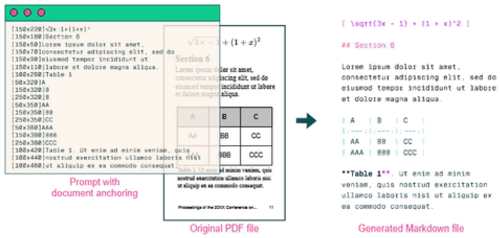

# olmOCR: Unlocking Trillions of Tokens in PDFs with Vision Language Models

Jake Poznanski❤️  
Jason Dunkelberger Regan Huff Daniel Lin Aman Rangapur Christopher Wilhelm  
Kyle Lo❤️ Luca Soldaini❤️  
Allen Institute for AI, Seattle, USA  
{jakep|kylel|lucas}@allenai.org  
❤️ indicates core contributors.  

## Abstract

PDF documents have the potential to provide trillions of novel, high-quality tokens for training language models. However, these documents come in a diversity of types with differing formats and visual layouts that pose a challenge when attempting to extract and faithfully represent the underlying content for language model use. We present OLMOCR, an open-source Python toolkit for processing PDFs into clean, linearized plain text in natural reading order while preserving structured content like sections, tables, lists, equations, and more. Our toolkit runs a fine-tuned 7B vision language model (VLM) trained on a sample of 260,000 pages from over 100,000 crawled PDFs with diverse properties, including graphics, handwritten text and poor quality scans. OLMOCR is optimized for large-scale batch processing, able to scale flexibly to different hardware setups and convert a million PDF pages for only $190 USD. We release all components of OLMOCR including VLM weights, data and training code, as well as inference code built on serving frameworks including vLLM and SGLang.